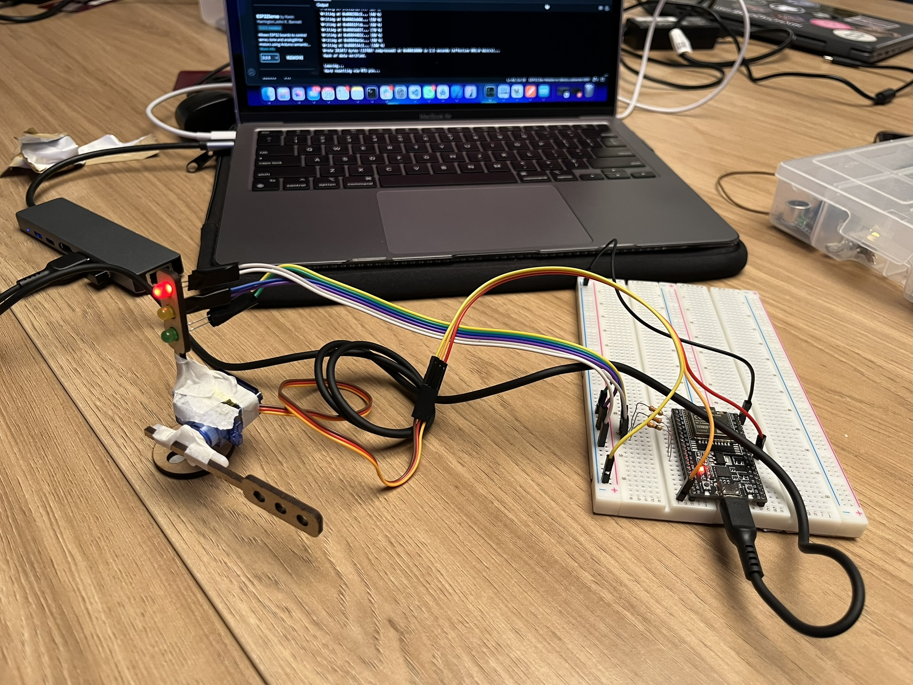

# Semáforo com Cancela

Atividade ponderada da semana 3 do modulo 4, desenvolvido por Heitor Candido

## Introdução

O projeto consiste em um semáforo com 3 fases (verde, amarelo e vermelho) e uma cancela que abre e fecha. O semáforo funciona de forma cíclica, ou seja, após a fase vermelha, o semáforo deve passar para a fase verde. A cancela deve abrir quando o semáforo estiver verde e fechar quando o semáforo estiver vermelho.

## Materiais

Os materiais utilizados para a montagem do projeto foram:

| Quantidade | Item            |
|------------|-----------------|
| 1          | Arduino         |
| 1          | Protoboard      |
| 1          | LED verde       |
| 1          | LED amarelo     |
| 1          | LED vermelho    |
| 3          | Resistor de 330Ω|
| 1          | Servo motor     |
| -          | Jumpers         |
| 1          | Suporte Semáforo|

## Circuito

O circuito é composto por 3 LEDs (verde, amarelo e vermelho) e um servo motor. Os LEDs são utilizados para representar as fases do semáforo e o servo motor é utilizado para representar a cancela.

### Foto do Circuito

    

 

# Avaliação Pares - 1

### Avaliador: Cecilia Galvão

| Critério                                                                                                 | Contempla (Pontos) | Contempla Parcialmente (Pontos) | Não Contempla (Pontos) | Observações do Avaliador |
|---------------------------------------------------------------------------------------------------------|--------------------|----------------------------------|--------------------------|---------------------------|
| Montagem física com cores corretas, boa disposição dos fios e uso adequado de resistores                | Até 3              | Até 1,5                            | 0                        |          3                 |
| Temporização adequada conforme tempos medidos com auxílio de algum instrumento externo                  | Até 3              | Até 1,5                          | 0                        |       3                    |
| Código implementa corretamente as fases do semáforo e estrutura do código (variáveis representativas e comentários) | Até 3              | Até 1,5                          | 0                        |       3                    |
| Extra: Implmeentou um componente de liga/desliga no semáforo e/ou usou ponteiros no código | Até 1              |  Até 0,5                         | 0                        |     3                      |
|  |                                                             |  | |**Pontuação Total:** 10|

 

# Avaliação Pares - 2

### Avaliador: Nataly De Souza Cunha

| Critério                                                                                                 | Contempla (Pontos) | Contempla Parcialmente (Pontos) | Não Contempla (Pontos) | Observações do Avaliador |
|---------------------------------------------------------------------------------------------------------|--------------------|----------------------------------|--------------------------|---------------------------|
| Montagem física com cores corretas, boa disposição dos fios e uso adequado de resistores                | Até 3              | Até 1,5                            | 0                        |          3                 |
| Temporização adequada conforme tempos medidos com auxílio de algum instrumento externo                  | Até 3              | Até 1,5                          | 0                        |       3                    |
| Código implementa corretamente as fases do semáforo e estrutura do código (variáveis representativas e comentários) | Até 3              | Até 1,5                          | 0                        |       3                    |
| Extra: Implmeentou um componente de liga/desliga no semáforo e/ou usou ponteiros no código | Até 1              |  Até 0,5                         | 0                        |     3                      |
|  |                                                             |  | |**Pontuação Total:** 10|
